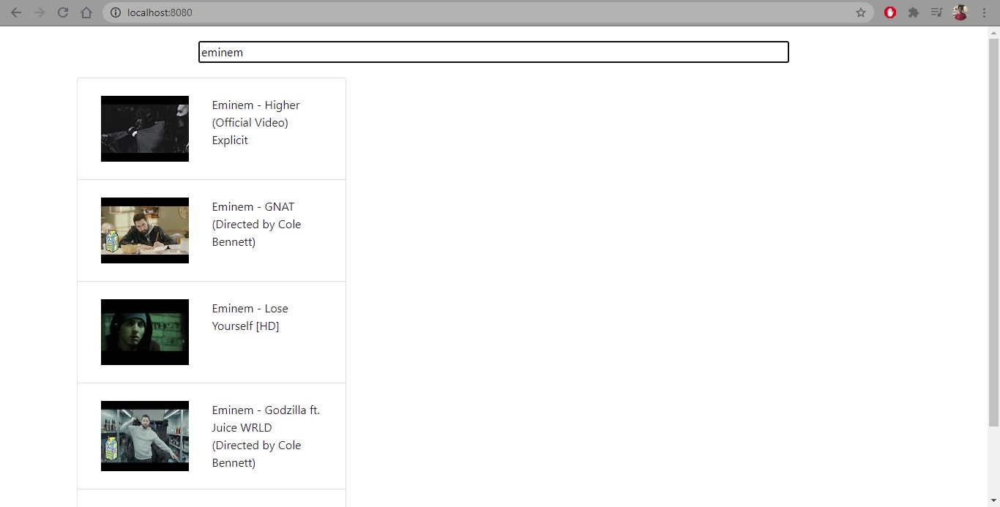

# video-browser

simple mimic youtube application based on vue

### requirements

- replace **API_KEY** in the _App.vue_ with your api key

### how the app looks like

<p>
    
</p>

and if you clicked on any result

<p>
    
</p>

## Project setup

```
npm install
```

### Compiles and hot-reloads for development

```
npm run serve
```

### Compiles and minifies for production

```
npm run build
```

### Lints and fixes files

```
npm run lint
```

### Customize configuration

See [Configuration Reference](https://cli.vuejs.org/config/).
